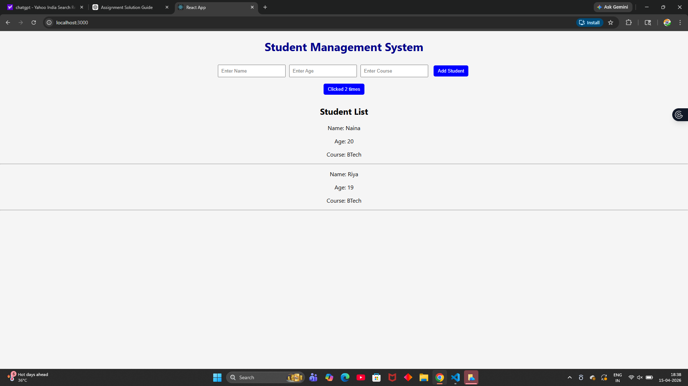

### `npm start`

Runs the app in the development mode.\
Open [http://localhost:3000](http://localhost:3000) to view it in your browser.

The page will reload when you make changes.\
You may also see any lint errors in the console.

### `npm test`

Launches the test runner in the interactive watch mode.\
See the section about [running tests](https://facebook.github.io/create-react-app/docs/running-tests) for more information.

# MERN Day 1 Assignment

This is my Day 1 MERN Stack assignment built using React.

## Live Demo
https://mern-day1-assignment-tau.vercel.app/

## Screenshorts

## Tech Stack
- React
- Node.js
- HTML
- CSS

## Run Locally

npm install
npm start
